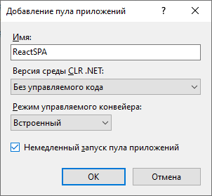
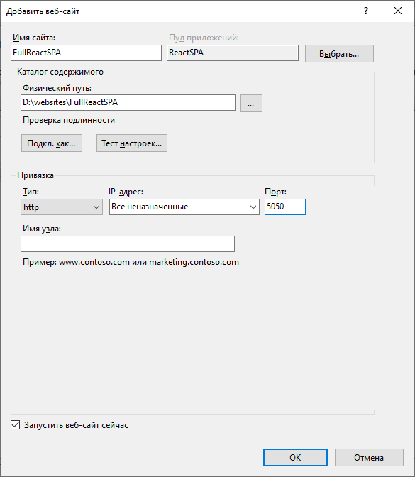
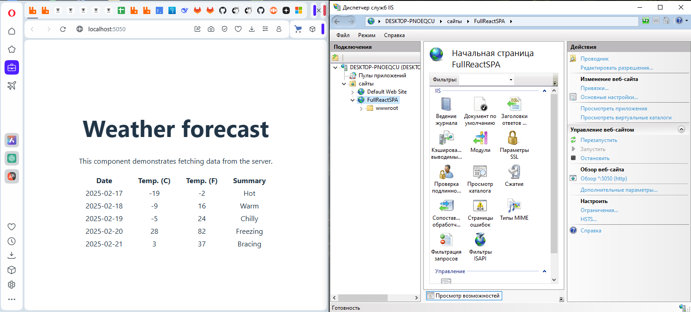

# Развёртывание на одном хосте

Согласно задания необходимо было создать шаблонный проект в Visual Studio "ASP.NET Core Web Application with React.js".
В результате создалось решение с двумя проектами: один для клиента на React (reactspa.full.client), второй для сервера с API (ReactSPA.Full.Server). Если приложение API опубликовать в каталог, то файлы клиента помещаются в каталог wwwroot.
Для работы сайта никаких доработок в созданных проектах не потребовалось. Достаточно было только настроить IIS.

