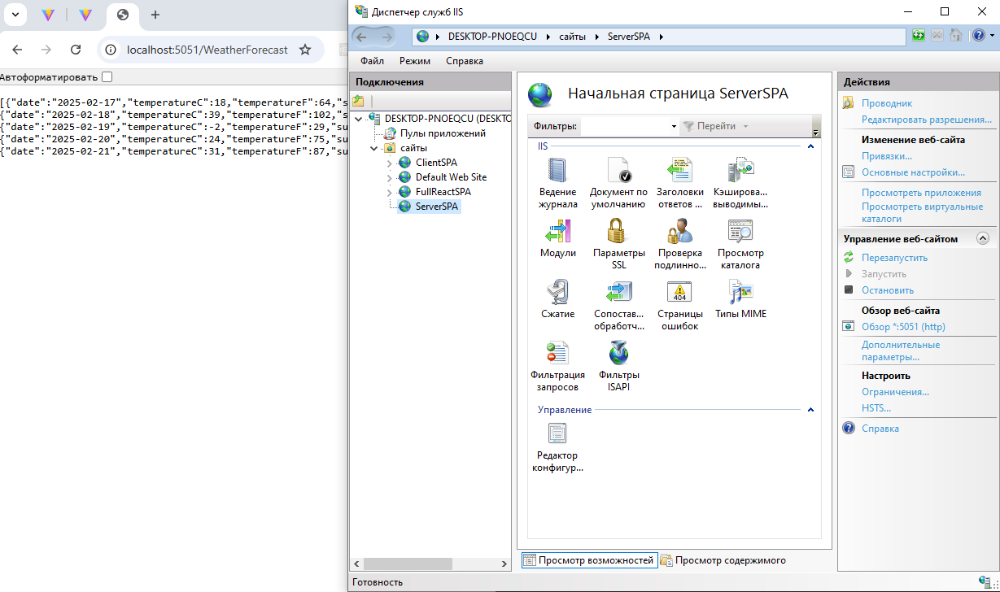
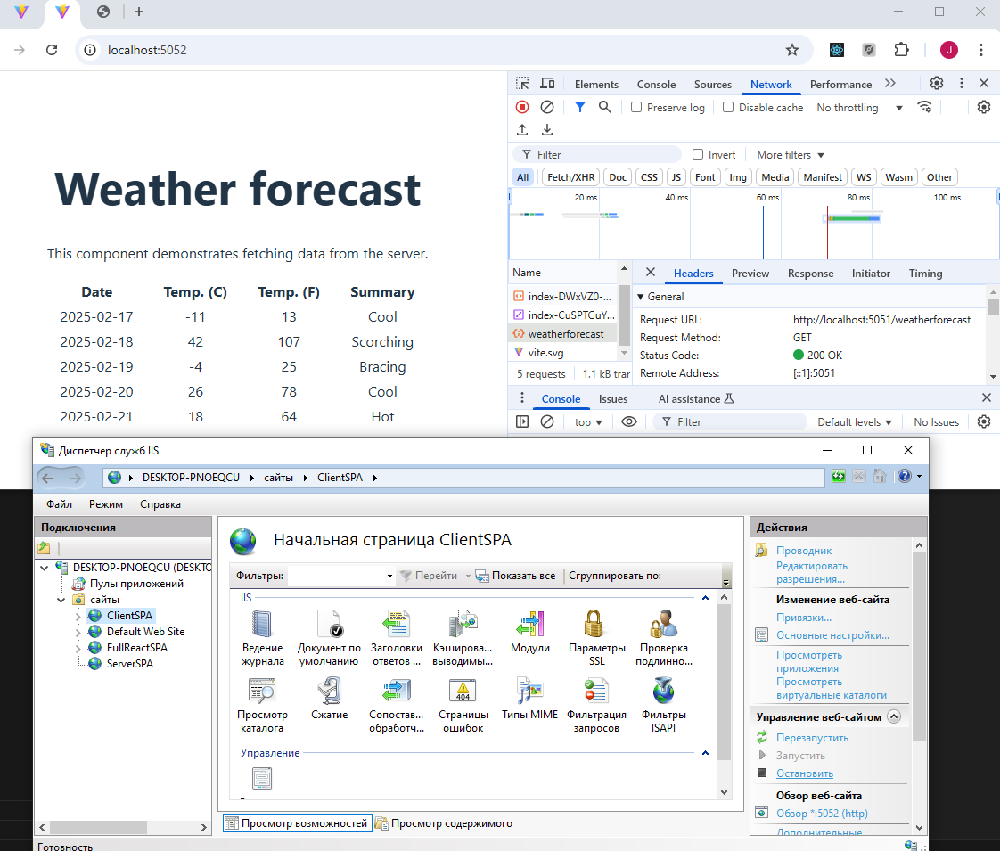

# Развёртывание на разных хостах

Был создан проект client-spa с vite в Visual Studio Code. Добавлен код для обращения к серверу с API:

```csharp
async function populateWeatherData() {
    const response = await fetch("http://localhost:5051/weatherforecast");
    const data = await response.json();
    setForecasts(data);
  }
```

Был создан проект ServerSPA в Visual Studio. Добавлен код для CORS:

```csharp
const string corsPolicy = "ClientSPA";

builder.Services.AddCors(options => options.AddPolicy(corsPolicy, builder => builder
    .WithOrigins("http://localhost:5052")
    .AllowAnyHeader()
    .AllowAnyMethod())
);
...
app.UseCors(corsPolicy);
```

Клиентское приложение развернуто на порту 5052.
Серверное приложение развернуто на порту 5051.




